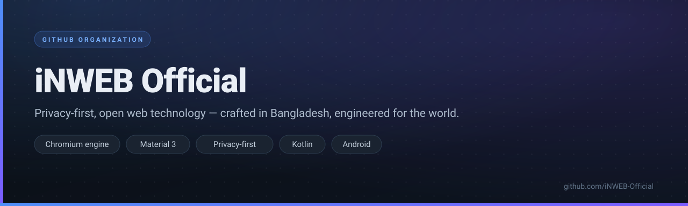

  
  

    &nbsp;
    &nbsp;
    &nbsp;
    
  

> [!NOTE]
> ### 🛡️ Privacy-first, open web technology
> Building a **real Chromium-based Android browser** and modern platform tools —
> crafted in Bangladesh 🇧🇩, engineered for the world.

---

## 🚀 Flagship project

### [🌐 iNWEB-Browser](https://github.com/iNWEB-Official/iNWEB-Browser)

A real Chromium-derived, privacy-focused Android browser — Chromium **source-based engine**, not a WebView wrapper.

  &nbsp;
  &nbsp;
  &nbsp;
  &nbsp;
  &nbsp;
  

  <a href="https://github.com/iNWEB-Official/iNWEB-Browser"><b>📦 View repository</b></a> ·
  <a href="https://github.com/iNWEB-Official/iNWEB-Browser/releases"><b>📥 Releases</b></a> ·
  <a href="https://github.com/iNWEB-Official/iNWEB-Browser/issues"><b>🐛 Report an issue</b></a>

---

## 🧭 What we're working on

| | Project | Status |
|---|---|---|
| 🌐 | **iNWEB Browser v1.0** — Material 3 UI, ad blocking & privacy dashboard | 🚧 Active development |
| 🛠️ | **Developer platform** — accounts, projects & tooling | 🧪 Early R&D |
| 🎨 | **Design system** — Material 3 component library for our apps | 🧪 Early R&D |

---

## 👥 Team

<table>
  <tr>
    <td align="center" width="200">
      <a href="https://github.com/iNWEB-Management">
         
        <b>iNWEB Management™</b> Owner · @iNWEB-Management
      </a>
    </td>
    <td align="center" width="200">
      <a href="https://github.com/YourSamiBD">
         
        <b>Your Sami BD</b> Member · @YourSamiBD
      </a>
    </td>
  </tr>
</table>

---

## 🤝 Get involved

- ⭐ **Star** [iNWEB-Browser](https://github.com/iNWEB-Official/iNWEB-Browser) to show your support
- 🐛 Found a bug? [Open an issue](https://github.com/iNWEB-Official/iNWEB-Browser/issues) — privacy reports are always welcome
- 👀 [Watch releases](https://github.com/iNWEB-Official/iNWEB-Browser/releases) to catch new builds early

---

  © 2026 <b>iNWEB Official</b> · Pabna, Bangladesh 🇧🇩

